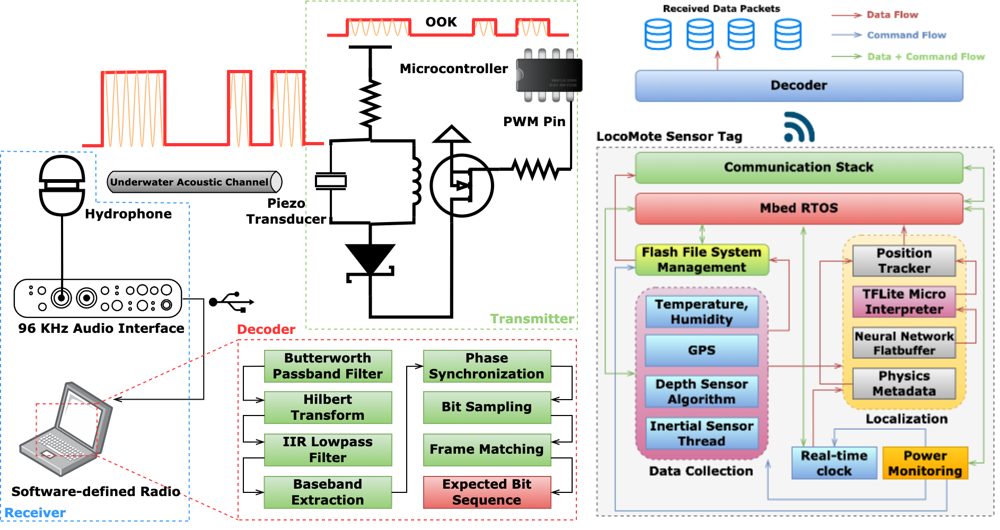

# LocoMote: AI-driven Sensor Tags for Fine-Grained Undersea Localization and Sensing




## Paper
https://www.researchgate.net/publication/379364381_LocoMote_AI-driven_Sensor_Tags_for_Fine-Grained_Undersea_Localization_and_Sensing

## Summary
Long-term and fine-grained maritime localization and sensing is challenging due to sporadic connectivity, constrained power budget, limited footprint, and hostile environment. In this paper, we present the design considerations and implementation of LocoMote, a rugged ultra-low-footprint undersea sensor tag with on-device AI-driven localization, online communication, and energy-harvesting capabilities. LocoMote uses on-chip (< 30 kB) neural networks to track underwater objects within 3 meters with ~6 minutes of GPS outage from 9DoF inertial sensor readings. The tag streams data at 2-5 kbps (< 10^-3 bit error rate) using piezo-acoustic ultrasonics, achieving underwater communication range of more than 50 meters while allowing up to 55 nodes to concurrently stream via randomized time-division multiple access. To recharge the battery during sleep, the tag uses an aluminum-air salt water energy harvesting system, generating upto 5 mW of power. LocoMote is ultra-lightweight (< 50 grams), tiny (32x32$x10 mm^3), consumes low power (~330 mW peak), and comes with a suite of high-resolution sensors. We highlight the hardware and software design decisions, implementation lessons, and the real-world performance of our tag versus existing oceanic sensing technologies. 

## Code Architecture
- ```encasement```: contains the ```.stl``` CAD files for the EPU-40 encasement and resin base.
- ```pcb```: contains the altium pcb design files for the main circuit board, and eagle pcb design files for the offline battery charger and pressure sensor board. PCB schematic and board design images are also provided.
- ```software```: contains code for: (a) data logging from all the sensors into the flash, also contains code to toggle data recovery modes from a computer using a Python script (```data_logger_demo```); (b) communication stack for the transmitter and receiver (```piezo_OOK_demo```); (c) PWM demo for piezo (```piezo_PWM_demo```); (d) GPS data logging and power measurement (```GPS```); (e) repository link for developing neural inertial navigation algorithms, as well as Marina Del Rey deployment IMU, GPS dataset; an importer is provided for the dataset (```neural_inertial_navigation```).

## Required items
- Altium Designer (21.x.x or higher) (https://www.altium.com/altium-designer/).
- AutoDesk Eagle (9.6.2 or higher) (https://www.autodesk.com/products/eagle/overview)
- TinkerCad (https://www.tinkercad.com/).
- For developing neural inertial navigation algorithms, check the requirements in ```software/neural_inertial_navigation/tinyodom```.
- MATLAB with all toolboxes installed (R2020a or better).
- Arduino IDE (https://www.arduino.cc/en/software/) with STM32 Core installed (https://github.com/stm32duino/Arduino_Core_STM32). The Arduino libraries required are listed in ```software/arduino_lib_links.txt```.
- Audacity (https://www.audacityteam.org/)
- Hardware: Check the pcb design files and the paper for list of hardware required and purchase links.


## Citation
Please cite this as:

Swapnil Sayan Saha, Caden Davis, Sandeep Singh Sandha, Junha Park, Joshua Geronimo, Luis Antonio Garcia and Mani Srivastava, "LocoMote: AI-driven Sensor Tags for Fine-Grained Undersea Localization and Sensing", in IEEE Sensors Journal, 2024, IEEE.


## Acknowledgements
This work was sponsored in part by the IoBT REIGN Collaborative Research Alliance funded by the Army Research Laboratory (ARL) under Cooperative Agreement W911NF-17-2-0196; in part by the King Abdullah University of Science and Technology (KAUST) through its Sensor Innovation research program; the NIH mHealth Center for Discovery, Optimization and Translation of Temporally-Precise Interventions (mDOT) under award 1P41EB028242; in part by the National Science Foundation (NSF) under awards #1705135 and 1822935; and in part the CONIX Research Center, one of six centers in Joint University Microelectronics Program (JUMP), a Semiconductor Research Corporation (SRC) program sponsored by the Defense Advanced Research Projects Agency (DARPA). The views and conclusions contained in this document are those of the authors and should not be interpreted as representing the official policies, either expressed or implied, of the ARL, DARPA, KAUST, NIH, NSF, SRC, or the U.S. Government. The U.S. Government is authorized to reproduce and distribute reprints for Government purposes notwithstanding any copyright notation here on.

